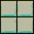
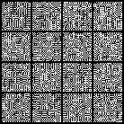

# LogicDiffusion

Execute generative math without the friction. 
A bare-bones implementation of Denoising Diffusion Probabilistic Models (DDPMs).

## The Why

You are reading up on diffusion models. The underlying math makes complete sense—Markov chains, Gaussian noise, reverse step prediction. You want to test a hypothesis, tweak a variance schedule, or just see the tensors in action.

But when you go looking for a baseline implementation, the landscape is frustrating.
You either have to clone a massive production framework like Diffusers and fight through 10,000 lines of legacy wrappers and config files, or you try to write it from scratch and lose three days to tensor shape mismatches. 

Here is the reality: **when you are learning or hacking on core generative AI, the bottleneck isn't your understanding of the math—it's the boilerplate.** You can grasp the reverse process in an afternoon. But isolating the actual code to modify it? That takes a week of context-switching.

The rapid pace of AI demands a better way to experiment. We don't need to wrestle with cluttered repositories just to test a simple UNet bottleneck.

LogicDiffusion is generative mechanics with near-zero friction. Stay in the flow state. Let the repository handle the plumbing.

## How It Works

**Trigger** — Open the repository in GitHub Codespaces. The `.devcontainer` instantly handles all PyTorch and CUDA dependencies. No local setup required.
**Forward** — The math iteratively injects Gaussian noise into your data, creating a clean Markov chain of increasingly noisy states.
**Reverse** — A minimal, highly-hackable U-Net learns to denoise the data step-by-step, predicting the exact noise added at each timestep.
**Execute** — The model hallucinates entirely new, high-fidelity data from pure static.

This isn't just a toy script. LogicDiffusion is designed to expose the architecture so you can actually interact with it.

## The Output



*(Generated samples transitioning from pure Gaussian noise back to data space).*

## The Tech Stack

**Framework: Pure PyTorch**
We needed a framework that stays completely out of the way. PyTorch lets us map the mathematical formulas exactly as they appear in the original papers. The tensors are transparent, and the operations are easy to step through in a debugger.

**Environment: GitHub Codespaces (Docker)**
Built for high-speed sprints. The included `devcontainer.json` spins up a dedicated virtual machine equipped with Python 3.10, PyTorch, and NVIDIA CUDA drivers. We eliminate the "it works on my machine" problem entirely.

**Architecture: U-Net + Time Embeddings**
A custom, stripped-down U-Net. It handles spatial downsampling and upsampling, but crucially injects standard time embeddings at the bottleneck. This ensures the network always knows *where* it is in the diffusion timeline.

## Architecture Flow

```text
┌─────────────────────────────────────────────────────────────────┐
│                      FORWARD PROCESS                            │
│  ┌──────────┐      ┌──────────┐      ┌──────────┐               │
│  │   x_0    │ ───► │   x_t    │ ───► │   x_T    │               │
│  │ (Image)  │      │ (Noisy)  │      │ (Static) │               │
│  └──────────┘      └──────────┘      └──────────┘               │
│                                                                 │
│          q(x_t | x_0) = N(x_t; √α_bar * x_0, (1-α_bar)I)        │
└─────────────────────────────────────────────────────────────────┘
                                │
                                ▼
┌─────────────────────────────────────────────────────────────────┐
│                      REVERSE PROCESS                            │
│  ┌──────────┐      ┌──────────┐      ┌──────────┐               │
│  │   x_0    │ ◄─── │   x_t    │ ◄─── │   x_T    │               │
│  │ (Image)  │      │ (Noisy)  │      │ (Static) │               │
│  └──────────┘      └──────────┘      └──────────┘               │
│           ▲               ▲               ▲                     │
│           │               │               │                     │
│           └─────── U-NET (Predicts Noise) ┘                     │
└─────────────────────────────────────────────────────────────────┘
```

## Implementation Notes

* **Continuous Time:** Time isn't just an integer; it's handled as a continuous variable projected through a Multi-Layer Perceptron (MLP) with GELU activations before merging with spatial features.
* **Variance Schedule:** Out of the box, it uses a standard linear beta schedule (`1e-4` to `0.02`). You can seamlessly swap this to a cosine schedule inside `diffusion.py`.
* **Total Decoupling:** The diffusion math is completely isolated from the neural network architecture. You can rip out the U-Net and drop in a Transformer without breaking the forward/reverse logic.

## Roadmap

Where we are taking this next:
* **Latent Space:** Moving operations from pixel space to a compressed latent space (like Stable Diffusion) to drastically reduce compute requirements.
* **Classifier-Free Guidance:** Adding text or class-label conditioning to steer the generation exactly where you want it.
* **Cross-Domain Adaptation:** Adjusting the U-Net to accept 3D coordinate inputs for molecular and protein generation experiments.

## Setup

**Zero-Storage Architecture**
This project is built explicitly for cloud-native execution. You do not need a single gigabyte of local storage, a massive local GPU, or a complex Python environment to run, train, or hack on this model. Everything is containerized and runs in the cloud.

**Quick Start (GitHub Codespaces - Zero Local Storage)**
1. Navigate to the top of the repo and click **Code** -> **Codespaces** -> **Create codespace on main**.
2. GitHub instantly provisions a dedicated container with PyTorch, CUDA drivers, and all dependencies pre-installed via the `.devcontainer`.
3. Open the terminal and execute:
```bash
python train.py
python generate.py
```

**Local Setup**
```bash
git clone [https://github.com/zumermalik/Logic-Diffusion-Model-v0](https://github.com/zumermalik/Logic-Diffusion-Model-v0)
cd Logic-Diffusion-Model-v0
pip install -r requirements.txt
python train.py
```